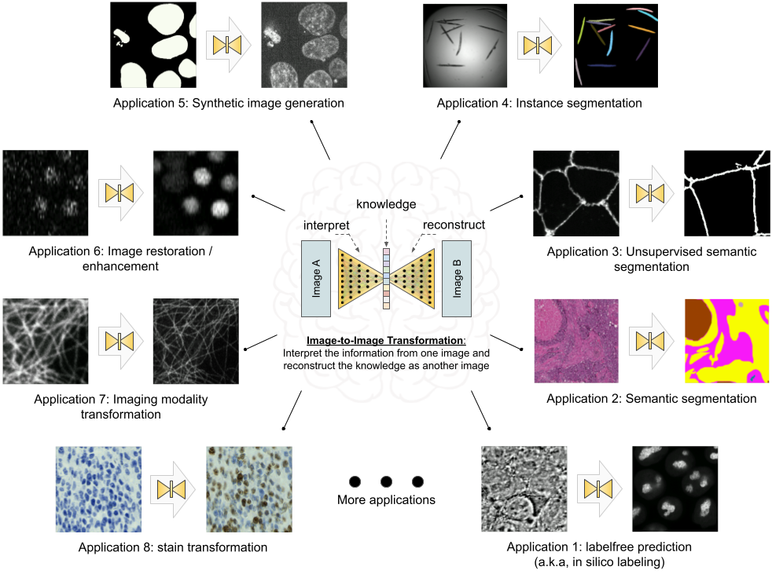

## Introduction

With the rapid advancements in the fields of machine learning (ML) and computer vision, computers can now transform images into new forms, enabling better visualization [@doi:10.1109/CVPRW.2017.151], better animation [@doi:10.1109/CVPR.2017.632] and better information extraction [@doi:10.1109/CVPR.2019.00963] with unprecedented and continuously growing accuracy and efficiency compared to conventional digital image processing. These techniques have recently been adapted for bioimaging applications and have revolutionized image-based biomedical research [@doi:10.1038/s41592-018-0111-2;@doi:10.1038/s42256-022-00471-x;@doi:10.1038/s41592-021-01080-z;@doi:10.1038/s41592-021-01249-6]. In principle, these techniques and applications can be formulated as a general image-to-image transformation problem, as depicted in the central panel in Figure {@fig:overview}. Deep neural networks are trained to perceive the information from the source image(s) and reconstruct the learned knowledge from source images(s) in the form of a new image(s) of the target type. The source and target images can be real or simulated microscopy images, segmentation masks, or their combinations, as exemplified in Figure {@fig:overview}. Since these underlying methods share the same essential spirit, a natural question arises: is it possible to develop a single generic codebase for deep learning (DL) based image-to-image transformation applicable to various biomedical studies?

In this paper, we introduce *MMV_Im2Im* an open-source microscopy machine vision (MMV) toolbox for image-to-image transformation and demonstrate its applications in over 10 biomedical tasks of various types by performing more than 30 experiments. Currently, *MMV_Im2Im* supports handling 2D~5D microscopy images for supervised image-to-image translation (e.g., labelfree determination [@doi:10.1038/s41592-018-0111-2], imaging modality transformation [@doi:10.1038/s41592-021-01155-x;@doi:10.1038/s42256-022-00471-x]), supervised image restoration [@doi:10.1038/s41592-021-01080-z], supervised semantic segmentation [@doi:10.1007/978-3-319-24574-4_28], supervised instance segmentation [@doi:10.1016/j.media.2022.102523;@embedseg], unsupervised semantic segmentation [@doi:10.1038/s42256-019-0096-2], unsupervised image to image translation and synthetization [@doi:10.1109/ICCV.2017.244]. The toolbox will continuously grow with more and more methods, such as self-supervised learning based methods, ideally also with contributions from the open-source community.

Why do we need such a single generic codebase for all deep-learning based microscopy image-to-image transformation? *MMV_Im2Im* is not simply a collection of many existing methods, but rather has a systematic design for generality, flexibility, simplicity and reusability, attempting to address several fundamental bottlenecks for image-to-image transformation in biomedical applications, as highlighted below.

### Feature 1: universal boilerplate with state-of-the-art ML engineering:

*Bottleneck: existing code not easy to understand or to extend or re-use*. 

Our package *MMV_Im2Im* employs pytorch-lightning [@doi:10.5281/zenodo.3828935] as the core in the backend, which offers numerous benefits, such as readability, flexibility, simplicity and reusability. First of all, have you ever had the moment when you wanted to extend someone’s open-source code to suit your special ML needs, but found it so difficult to figure out where and how to extend, especially for complex methods? Or, have you ever encountered the situation where you want to compare the methods and code from two different papers, even solving the same problem, e.g. semantic segmentation, but not quite easy to grasp quickly since the two repositories are implemented in very different ways? It is not rare that even different researchers from the same group may implement similar methods in very different manners. This is not only a barrier for other people to learn and re-use the open-source code, but also poses challenges for developers in maintenance, further development, and interoperability among different packages. We follow the pytorch-lightning framework and carefully design a universal boilerplate for image-to-image transformation for biomedical applications, where the implementation of all the methods share the same modularized code structure. For all PyTorch users, this greatly lowers the learning curve for people to read and understand the code, and makes implementing new methods or extending existing methods simple and fast, at least from an engineering perspective.

Moreover, as ML scientists, have you ever been overwhelmed by different training tricks for different methods or been curious about if certain state-of-the-art training methods can boost the performance of existing models? With the pytorch-lightning backend, *MMV_Im2Im* allows you to enjoy different state-of-the-art ML training engineering techniques without changing the code, e.g., stochastic weight averaging [@swatrain], single precision training, automatic batch size determination, different optimizers, different learning rate schedulers, easy deployment on different devices, distributed training on multi-GPU (even multi-node), logging with common loggers such as Tensorboard, etc.. In short, with the pytorch-lightning based universal boilerplate, bioimaging researchers can really focus on research and develop novel methods for their biomedical applications, without worrying about the ML engineering works (which are usually lacking in non-computer-science labs).

### Feature 2: modularization and human-readable configuration system:

*Bottleneck: Dilemma between simplicity and flexibility*

The toolbox is designed for both people with or without extensive experience with ML and Python programming. It is not rare to find biomedical image analysis software that is very easy to use on a set of problems, but very hard to extend or adjust to other different but essentially related problems, or find some with great flexibility with tunable knobs at all levels, but unfortunately not easy for inexperienced users. To address this issue, we design the toolbox in a systematically modularized way with various levels of configurability. One can use the toolbox with a single command as simple as `run_im2im --config train_semanticseg_3d --data.data_path /path/to/data` or make customization on details directly from a human-readable configuration file, such as choosing batch normalization or instance normalization in certain layers of the model, or adding extra data augmentation steps, etc.. We provide an extensive list of more than 20 example configurations for various applications and comprehensive documentation to address common questions for users as reference. For users preferring graphical interface, another napari plugin for the MMV toolbox has been planned as the extension of *MMV_Im2Im* (see Discussion for details).

In addition, the modularization and configuration system is designed to allow not only configuring with the elements offered by the package itself, but also any compatible elements from a third-party package or from a public repository on Github. For example, one can easily switch the 3D neural network in the original *Embedseg* method to any customized U-Net from FastAI by specifying the network as `fastai.vision.models.unet`. Such painless extendability releases the power of the toolbox, amplifies the benefit of the open-source ML community and upholds our philosophy of open science.

### Feature 3: customization for biomedical imaging applications:

*Bottleneck: Not enough consideration for specific challenges in microscopy images in general DL toolboxes*

The original idea of a general toolbox actually stemmed from the OpenMMLab project (<https://openmmlab.com/>), which provides generic codebases for a wide range of computer vision research topics. For instance, *MMSegmentation* (<https://github.com/open-mmlab/mmsegmentation>) is an open source toolbox for semantic segmentation, supporting unified benchmarking and state-of-the-art models ready to use out-of-box. It has become one of most widely used codebase for research in semantic segmentation (2.3K forks and 6.5K stars on Github as of September 29, 2023). This inspires us to develop *MMV_Im2Im* to facilitate research in image-to-image transformation with a special focus on biomedical applications.

First of all, different from general computer vision datasets, such as ImageNet [@doi:10.1109/CVPR.2009.5206848], where the images are usually small 2D RGB images (e.g., 3 x 256 x 256 pixels), biomedical applications usually involves large-scale high dimensional data (e.g., 500 images of 4 x 128 x 2048 x 2048 voxels). To deal with this issue, we employ the PersistentDataset in MONAI [@doi:10.5281/zenodo.4323059] with partial loading and sampling support, as well as delayed image reading powered by aicsimageio [@aicsimageio] as default (configurable if another dataloader is preferred). As a result, in our stress test, training a 3D nuclei instance segmentation model with more than 125,000 3D images can be conducted efficiently in a day, even with limited resources.

Second, because microscopy data is not restricted to 2D, we re-implement common frameworks, such as fully convolutional networks (FCN), conditional generative models, cycle-consistent generative models, etc., in a generic way to easily switch between different dimensionalities for training. During inference, up to 5D images (channel x time x Z x Y x X) can be directly loaded as the input without pre-splitting into smaller 2D/3D chunks.

Third, the toolbox pre-packs common functionalities specific to microscopy images. For example, we incorporate the special image normalization method introduced in [@doi:10.1038/s41592-018-0111-2], where only the middle chunk along the Z dimension of 3D microscopy images will be used for calculating the mean and standard deviation of image intensity for standard normalization. Also, 3D light microscopy images are usually anisotropic, i.e., much lower resolution along Z than XY dimension. So, we adopt the anisotropic variation of UNet as proposed in [@doi:10.1101/491035].

Finally, to deploy the model in production, a model trained on small 3D patches sometimes needs to be applied not only on much larger images. Combining the efficient data handling of aicsimageio [@aicsimageio] and the sliding window inference with gaussian weighted blending, the toolbox can yield efficient inference without visible stitching artifacts in production.

All in all, the *MMV_Im2Im* toolbox stands on the shoulders of many giants in the open-source software and ML engineering communities (pytorch-lightning, MONAI, aicsimageio, etc.) and is systematically designed for image-to-image transformation R&D for biomedical applications. The source code of *MMV_Im2Im* is available at <https://github.com/MMV-Lab/mmv_im2im>. This manuscript is generated with the open-source package Manubot [@doi:10.1371/journal.pcbi.1007128]. The manuscript source code is available at <https://github.com/MMV-Lab/im2im-paper>.

{#fig:overview width="100%" height="53%"}
