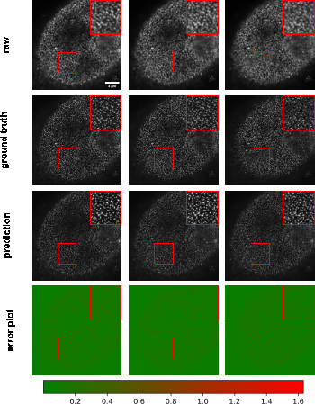
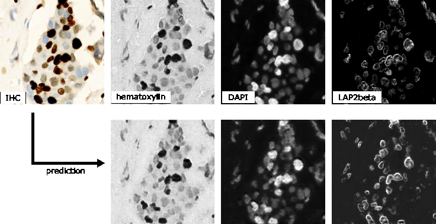

## Results

In this section, we showcase the versatility of the *MMV_Im2Im* toolbox by presenting over ten different biomedical applications across various R&D use cases and scales. All experiments and results in this section were conducted on publicly available datasets released with other publications and our scripts (for pulling the public dataset online and data wrangling) and configuration files (for setting up training and inference details), both included in the MMV_Im2Im package. Our aim is to make it easy to reproduce all of the results in this paper, and more importantly use these data and scripts to get familar with the package and adapt to new problems of users' interest. It is important to note that the aim of these experiments was not to achieve the best performance on each individual task, as this may require further hyper-parameter tuning (see Discussion section for more details). Rather, the experiments were intended to demonstrate the package's different features and general applicability, providing a holistic view of image-to-image transformation concepts to biomedical researchers. We hope that these concepts will help researchers integrate AI into traditional assay development strategies and inspire computational and experimental co-design methods, enabling new biomedical studies that were previously unfeasible.

### Labelfree prediction of nuclear structure from 2D/3D brightfield images

The labelfree method refers a DL method that can predict fluorescent images directly from transmitted light brightfield images [@doi:10.1038/s41592-018-0111-2]. Comparing to brightfield images, fluorescent images can resolve subcellular structures in living cells at high resolution but with the cost of expensive and slow procedures and high phototoxicity. The labelfree method provides a new perspective in assay development to conduct integrated computational analysis of multiple organelles only with a single brightfield image acquisition. In our first demonstration, we applied *MMV_Im2Im* to build 2D/3D models that can predict fluorescent images of nuclear structures from brightfield images. For 3D models, we also compared (1) different image normalization methods, (2) different network backbones, and (3) different types of models. 

It should be noted that while we recognize the importance of systematically evaluating the predictions, such an analysis falls outside the scope of this paper. We argue that an appropriate evaluation methodology should depend on specific downstream quantitative analysis goals (e.g., [@doi:10.1371/journal.pcbi.1008443;@doi:10.48550/ARXIV.2302.01790]). For example, if our aim is to quantify the size of nucleoli, we must compare the segmentation derived from real nucleoli signals to that of the predicted nucleoli segmentation, ensuring that measurements from both are consistent. Alternatively, if the goal is to localize the nucleoli roughly within the cell, Pearson correlation may be a more appropriate metric. In this work, we concentrate on visual inspection, using Pearson correlation and structural similarity as a rough quantitative reference. Our intent is to demonstrate the utility of our *MMV_Im2Im* package, and leave appropriate evaluations to users in their specific problems in real studies.

*2D Labelfree:* We started with a simple problem using 2D images from the HeLa "Kyoto" cells dataset [@doi:10.5281/zenodo.6139958]. For all images, we took the brightfield channel and the mCherry-H2B channel out of the multi-channel timelapse movies. 2D images were acquired at 20x with 0.8 N.A. and then downscaled by 4 (pixel size: 0.299 nm x 0.299 nm). Example predictions can be found in Figure {@fig:labelfree}-A. We compared a basic UNet model [@doi:10.1007/978-3-319-24574-4_28] and a 2D version of the fnet model in [@doi:10.1038/s41592-018-0111-2]. The fnet model achieved slightly more accurate predictions than the basic UNet. 

*3D Labelfree:* We tested with 3D images from the hiPS single cell image dataset [@doi:10.1038/s41586-022-05563-7]. Specifically, we extracted the brightfield channel and the structure channel from the full field-of-view (FOV) multi-channel images, from the HIST1H2BJ, FBL, NPM1, LMNB1 cell lines, so as to predict from one brightfield image various nuclear structures, histones, nucleoli (dense fibrillar component via fibrillarin), nucleoli (granular component via nucleophosmin), and nuclear envelope, respectively. Images were acquired at 100x with 1.25 NA (voxel size: 0.108 micron x 0.108 micron x 0.29 micron). 

We conducted three groups of comparisons (see results in Figure {@fig:labelfree}-B). First, we compared three different image normalization methods for 3D images: percentile normalization, standard normalization, center normalization [@doi:10.1038/s41592-018-0111-2]. Percentile normalization refers to cutting the intensity out of the range of [0.5, 99.5] percentile of the image intensity and then rescale the values to the range of [-1, 1], while the standard normalization is simply subtracting mean intensity and then divided by the standard deviation of all pixel intensities. Center normalization is similar to standard normalization, but the statistics are calculated only around center along the Z-axis [@doi:10.1038/s41592-018-0111-2]. One could easily test different percentile or rescaling to [0, 1] instead of [-1, 1]. Qualitatively, we found center normalization slightly more accurate and more robust than the other two (ref. the first row in Figure {@fig:labelfree}-B).

Second, we compared different network backbone architectures, including the original fnet model [@doi:10.1038/s41592-018-0111-2], an enhanced UNet [@doi:10.1007/978-3-030-12029-0_40], the attention UNet [@attentionUnet], two transformer-based models, SwinUNETR [@doi:10.1007/978-3-031-08999-2_22] and UNETR[@doi:10.1109/WACV51458.2022.00181] (all with center normalization). Inspecting the predictions on a holdout validation set suggested that fnet achieved the best performance, and the transformer-based models did not work well in labelfree problems (ref. the second row and the "c + fnet" from the first row in Figure {@fig:labelfree}-B).

Finally, we showed the comparison between three different types of models, an FCN-type model (i.e., fnet), a pix2pix-type model, and a cycleGAN-type model. For fair comparison, we used fnet as the same backbone for all three types of models. In theory, the pix2pix-type model can be trained in two different ways: from scratch or initializing the generator with a pre-trained fnet (trained as FCN). Examples of the comparison results were shown in the last two rows in Figure {@fig:labelfree}-B. Visually, it is evident that the additional adversarial components (i.e., the discriminator) could generate images with more realistic appearance than a typical FCN-type model alone, but again, we leave the appropriate quantitative evaluations to users' specfic biomedical studies.

From the experiments above, we found that center normalization + pix2pix with fnet as the generator achieved the best overall performance qualitatively. So, we employed the same strategy on all other nuclear structures. At the end, we had four different labelfree models, each predicting one different nuclear structure from 3D brightfield images. As an example of evaluation, we calculated the pearson correlation and structural similarity on hold-out validation sets. The results were summarized in Table {@tbl:labelfree_table}. Again, these numbers were merely examples of evaluation, systematic evaluation based on each specific biological problem would be necessary before deployment. Figure {@fig:labelfree}-C showed one example of all four different structures predicted from a single unseen brightfield image. This would permit an integrated analysis of four different nuclear components that could hardly be acquired simultaneously in real experiments and real images.

| Dataset | Pearson Correlation | Structural Similarity | # of Test Data |
|----------|----------|----------|----------|
| FBL | 0.900 ± 0.013| 0.858 ± 0.029| 50 |
| HIST1H2BJ | 0.886 ± 0.023| 0.758 ± 0.069| 55 |
| LMNB1 | 0.884 ± 0.020| 0.701 ± 0.061| 50 |
| NPM1 | 0.937 ± 0.008| 0.834 ± 0.025| 55 |

Table: Evaluation of the final 3D label-free models for four different nuclear structures. {#tbl:labelfree_table}

{#fig:labelfree_comparison width="76%" height="90%"} 

{#fig:labelfree_comparison width="76%" height="90%"} 

### 2D semantic segmentation of tissues from H&E images (TODO: Update figure, add stds)

Segmentation is a common image processing task, and can be considered as a special type of image-to-image transformation, where the generated images are segmentation masks. DL-based methods have achieved huge success in semantic segmentation in biomedical images. In this example, we demonstrated *MMV_Im2Im* on a pathology application to segment glands from hematoxylin and eosin (H&E) stained tissue images from the 2015 Gland Segmentation challenge [@doi:10.1109/TMI.2015.2433900;@doi:10.1016/j.media.2016.08.008]. Stain normalization is an important pre-processing step in order to develop models robust to stain variation and tissue variations. *MMV_Im2Im* included a classic stain normalization method [@doi:10.1109/ISBI.2009.5193250] as a pre-processing step. The effect of stain normalization can be observed in Figure {@fig:2d_gland}-A and B. We trained a simple attention UNet model [@attentionUnet]. Evaluated on the two different hold-out test sets, the model achieved F1-score, 0.904 ± 0.060 and 0.861 ± 0.117 on test set A and test set B, respectively. The performance was competitive compared to the methods reported in the challenge report [@doi:10.1016/j.media.2016.08.008], especially with much more consistent performance across the two different test sets. Example results can be found in Figure {@fig:2d_gland}-C.

{#fig:2d_gland width="75%"} 

### Instance segmentation in microscopy images

Instance segmentation is a type of segmentation problem that goes beyond semantic segmentation. The goal is to differentiate not only between different types of objects, but also different instances of the same type of objects. Currently, the *MMV_Im2Im* package supports *EmbedSeg*-type models. The major benefit of EmbedSeg-type models is their agnosticism to the morphology and dimensionality of the object instances, compared to other models such as StarDist [@doi:10.1007/978-3-030-00934-2_30;@doi:10.1109/WACV45572.2020.9093435], SplineDist [@doi:10.1109/ISBI48211.2021.9433928] and Cellpose [@doi:10.1038/s41592-020-01018-x]. For example, different from the others, *EmbedSeg*-type models are even able to generate instance segmentation where each instance contains multiple connected components. Additional frameworks such as Omnipose [@doi:10.1038/s41592-022-01639-4] will be supported in future versions. Another mainstream category of instance segmentation methods are detection-based models, such as Mask-RCNN [@doi:10.1109/TPAMI.2018.2844175]. However, these models are better suited to the detection framework rather than image-to-image transformation (see Discussion section for details).

The *EmbedSeg*-type models were re-implemented according to the original paper [@doi:10.1016/j.media.2022.102523;@embedseg] following the generic boilerplate in *MMV_Im2Im*, with significant improvement. First of all, following the modular design of *MMV_Im2Im*, it is flexible to use different neural network models as the backbone. For 3D anisotropic microscopy image, the original backbone ERFNet [@doi:10.1109/TITS.2017.2750080] doesn't take the anisotropic dimensions into account and therefore may not perform well or even not applicable. In this scenario, it is straighforward to employ another anisotropic neural network bone, such as the anisotropic U-Net in [@doi:10.1101/491035] or the anisotropic version of Dynamic U-Net in MONAI. Second, we significantly improve training strategy. The original version requires pre-cropping patches centered around each instance and pre-calculated the center images and class images. This may generate a massive amount of additional data on the disk. More importantly, such pre-cropping makes data augmentation nearly impossible, except the simple ones like flipping (otherwise, the pre-calculated centers might be wrong), and also greatly undersamples around negative cases (e.g., background). For example, we have observed that for an Embedseg model training only with patches centered around instances, the model may suffer from degraded performance during inference when there are a large amount of background areas without any instances. Again, following the modular design of *MMV_Im2Im*, it is now possible to do on-the-fly data augmentation and patch sampling, even weighted patch sampling. Third, our improved *Embedseg*-type models can accept an exclusion mask so that certain parts of the images can be ignored during training. This is especially useful for partially annotated ground truth. For large images, it could be extremely time-consuming to require every single instance to be annotated. The exclusion masks can address this bottleneck. Another extension comparing to the original implementation was that the *MMV_Im2Im* package made sliding windowing inference straightforward, and therefore permitted easy handling of images of any size during inference.

In this work, we tested on both 2D and 3D instance segmentation problems. Going from 2D to 3D is not a simple generalization from 2D models by switching 2D operations with 3D operations, but with many practical challenges. Large GPU footprint is one of the biggest issues, which makes many training strategies common in 2D not feasible in 3D, e.g. limited mini-batch size. *MMV_Im2Im* is able to take advantage of state-of-the-art ML engineering methods to efficiently handle 3D problems. For example, by using effective half-precision training, one can greatly reduce GPU memory workload for each sample and therefore increase the batch size or the patch size. When multiple GPUs are available, it is also possible to easily take advantage of the additional resources to scale up the training to multiple GPU cards, even multiple GPU nodes. As a demonstration, we applied *EmbedSeg*-like models to a 2D problem of segmenting *C. elegans* from widefield images [@doi:10.1021/cb900084v], as well as a 3D problem of nuclear segmentation from fluorescent and brightfield images from the hiPS single-cell image dataset [@doi:10.1038/s41586-022-05563-7].

For the 2D problem, we adopted the same network backbone as in the original *EmbedSeg* paper. Example results on a small holdout set are shown in Figure {@fig:instance}-A (IoU = 0.879 ± 0.026), which is comparable to the original published results [@embedseg].  For the 3D problem, the original backbone is not directly applicable, due to the aforementioned anisotropic issue and the images in the dataset do not contain enough Z-slices to run through all down sampling blocks in 3D. The anisotropic UNet [@doi:10.1101/491035] is used here. The segmentation results obtained from the public dataset [@doi:10.1038/s41586-022-05563-7] contain nuclear instance segmentation of all cells. But, the cells touching the image borders are ignored from downstream analysis [@doi:10.1038/s41586-022-05563-7] and therefore not curated. In other words, the segmentation from this public dataset can only be used as high-quality nuclear instance segmentation ground truth after excluding the areas covered by cells touching the image borders [@doi:10.1038/s41586-022-05563-7]. Therefore, the exclusion masking function in *MMV_Im2Im* is very helpful in this example. 

Example results were presented in {@fig:instance}-B. The green box highlighted a mitotic cell (the DNA signals forming "spaghetti" shapes). Besides roughly separating the DNA signals from background, the model was also able to correctly identify the instance identity, which would be theoretically infeasible for other instance segmentation models like StarDist or CellPose. Nuclear instance segmentation from brightfield images was much more challenging than from fluorescent images. Arguably, this could be thought of as one single model doing two transformations: predicting the DNA signals from brightfield and running instance segmentation on predicted DNA signals. From Figure {@fig:instance}-B, it was shown that the segmentation from brightfield images was comparable to the segmentation from fluorescent images, but with two caveats. First, the performance on mitotic cells was worse than the model using fluorescent images. We hypothesized this could be due to the limited information in brightfield images for mitotic cells, compounded with limited number of mitotic cells in the whole training set (less than 10%). Second, the performance along Z dimension was also worse than the fluorescent model, as explained by the side view in Figure {@fig:instance}-B. This could be explained by the different properties of brightfield imaging and fluorescent imaging, but would need further comprehensive studies to investigate and confirm. 

{#fig:instance width="75%"}

### Comparing semantic segmentation and instance segmentation of organelles from 3D confocal microscopy images 

We did a special comparison in this subsection to further illustrate the difference between semantic and instance segmentations. We took the 3D fibrillarin dataset from [@doi:10.1038/s41586-022-05563-7]. There are multiple channels in each 3D images, including DNA dye, membrane dye, and the structure channel (i.e., fibrillarin in this case). The original fibrillarin segmentation released with the dataset is a semantic segmentation (0=background, 1=fibrillarin). With the additional cell segmentation available in the dataset, we can know which groups of segmented fibrillarin belong to the same cell. Then, we can convert the original 3D fibrillarin semantic segmentation ground truth into 3D instance segmentation ground truth (fibrillarin pixels belonging to the same cell are grouped as a unique instance). Sample images and results are shown in Figure {@fig:3dseg}. We can observe that the semantic segmentation model is able to achieve good accuracy in determining pixels from the fibrillarin signals. Meanwhile, the instance segmentation can group them properly so that fibrillarin masks from the same cell are successfully identified as unique instances, even without referring to the cell membrane channel or cell segmentation results. This is not a simple grouping step based on distance, since the fibrillarin signals from tightly touching nuclei may exist very close to each other.

{#fig:3dseg width="75%"}

### Unsupervised semantic segmentation of intracellular structures from 2D/3D confocal microscopy images (TODO: adjust text, 2d results are not more plausible as before)

Large amounts of high-quality segmentation ground truth is not always available, or may require endless effort to collect for a segmentation task. CycleGAN-based methods have opened up a new avenue for segmentation without the need for pixel-wise ground truth [@doi:10.1038/s42256-019-0096-2]. In this subsection, we demonstrate an unsupervised learning-based segmentation method on four examples: 2D tight-junction (via ZO1) segmentation from 2D FP-tagged ZO1 images (max-projected from 3D stacks), and segmentation of nuclei, mitochondria, and golgi from 3D confocal microscopy images.

To perform unsupervised learning, we used raw images from the hiPS single-cell image dataset [@doi:10.1038/s41586-022-05563-7], as well as their corresponding segmentations (may not be absolute pixel-wise ground truth, but have gone through systematic evaluation to ensure the overall quality). We shuffled the raw images and their segmentations to generate a set of simulated segmentation masks. A demonstration of the concept is illustrated in Figure {@fig:unsupervised}-A. Example results for all 3D models are shown in Figure {@fig:unsupervised}-B, and the F1-scores on the test set are summarized in Table {@tbl:unsuper}.

Interestingly, on the 2D ZO1 example, we observed that the segmentation generated by the unsupervised learning method was actually slightly better than the original segmentation obtained from a classic image segmentation workflow as in [@doi:10.1101/491035]. For the 3D examples, it has been suggested that the quality of unsupervised nuclei segmentation could be further improved with additional simulation strategies [@doi:10.1038/s42256-019-0096-2]. Overall, we believe that unsupervised learning offers an effective way to generate preliminary segmentation, which can be further refined through active learning such as the iterative DL workflow described in [@doi:10.1101/491035]

| Dimensionality | Dataset | F1 Score | # of Test Data |
|----------|----------|----------|----------|
| 2D | tight-junction | 0.906 ± 0.011 | 18 |
| 3D | nucleus | 0.836 ± 0.081| 31 |
| 3D | golgi | 0.689 ± 0.057| 44 |
| 3D | mitochondria | 0.804 ± 0.015| 54 |

Table: F1 scores of the unsupervised semantic segmentation predictions. {#tbl:unsuper width="90%"}

{#fig:unsupervised width="80%"}

### Generating synthetic microscopy images from binary masks 

Generating a large amount of synthetic microscopy images can be an important step in developing image analysis methods. Synthetic images offer a way to train other DL models, such as self-supervised pre-training, using a diverse set of images without the need for large amounts of real-world data. As long as the synthetic images are generated with sufficient quality, it is possible to have an unlimited amount of training data for certain applications. Moreover, synthetic images can be used to evaluate other models when validation data is difficult to obtain. In this study, we demonstrate that *MMV_Im2Im* can generate 2D/3D synthetic microscopy images with high realism and validity, using a subset of data collected from the hiPS single-cell image dataset [@doi:10.1038/s41586-022-05563-7], either in a supervised or unsupervised manner.

For 2D demonstration, we extracted the middle Z-slice from NPM1 images as the training target, while using the NPM1 segmentation results as the input binary mask. With the paired "mask + microscopy image" data, we could train the model in a supervised fashion, or randomly shuffle the data to simulate the situation without paired data which can be trained in an unsupervised fashion using the CycleGAN framework implemented in *MMV_Im2Im*. Example results can be found in Figure {@fig:synthetic}-A. In general, the supervised synthesization can generate more realistic images than the unsupervised model.

For 3D demonstration, we use 3D H2B images with two different types of input masks. First, we attempted to generate synthetic images from a coarse mask (i.e., only the overall shape of the nucleus, available as nuclear segmentation from the dataset) with both supervised training and unsupervised training. The unsupervised model in *MMV_Im2Im* uses the CycleGAN-based approaches. So, the unsupervised training is actually already done within the unsupervised segmentation experiments. In other words, the unsupervised model works in a bi-directional way, from real microscopy images to binary masks, and also from binary masks to simulated microscopy images. Here, we just do the inference in a different direction (from binary to simulated microscopy) using the model trained in unsupervised segmentation section. The results are shown in Figure {@fig:synthetic}-B (row 1). Similar to the results in 2D demonstration, the unsupervised synthesization can mostly "paint" the mask with homogeneous grayscale intensity, while the supervised model can simulate the textures to some extent. For a relatively large mask, it could be chanllenging for a model to fill in sufficient details to simulate real microscopy images (might be improved with diffusion-based models, see Discussions). 

We made another attempt with 3D masks containing finer details beyond the overall shapes. So, we employed the H2B structure segmentation results from the dataset (capturing the detailed nuclear components marked by histon H2B) as the input for supervsied synthesization. The result is shown in Figure {@fig:synthetic}-B (row 2). Compared to the synthesization with coarse masks, the images simulated from fine masks exhibit a much more realistic appearance. As we can see, it is important to design the solutions with proper data.

{#fig:synthetic width="60%"}

### Image denoising for microscopy images

*MMV_Im2Im* can also be used to computationally reduce image noise or restore the data from various sources of imaging artifacts, so as to increase the feasibility and efficiency in downstream analysis. In the current version of *MMV_Im2Im*, the restoration model can only be trained in a fully supervised manner. Therefore, aligned low-quality and high-quality images are required for supervision, even though such pair data can be partially simulated [@doi:10.1038/s41592-021-01080-z]. Other methods, such as unsupervised learning-based solutions [@doi:10.1109/ISBI45749.2020.9098612,@HDN], will be made available within *MMV_Im2Im* in future versions. 

In this example, we presented an image denoising demonstration with sample data from [@doi:10.1038/s41592-018-0216-7]. The goal was to increase the quality of low signal-to-noise ratio (SNR) images of nucleus-stained flatworm (Schmidtea mediterranea) and lightsheet images of Tribolium castaneum (red flour beetle) embryos. The models were trained with paired data acquired with low and high laser intensity on fixed samples, and then applied on live imaging data. For the nucleus-stained flatworm data (a test set of 20 images are available), the model achieved pearson correlation of 0.923 ± 0.029 and structural similarity of 0.627 ± 0.175. Based on the results in Figure {@fig:denoising}, it can be observed that the low SNR images can be greatly improved. Systematic quantitative evaluations would be necessary to confirm the biological validity, but beyond the scope of this paper.

![(A) Denoising results of 3D images of nucleus-stained flatworm at two different z-slices. Left: raw images (low SNR), middle: reference images (high SNR), right: predictions. (B) Denoising results of 3D lightsheet images of Tribolium castaneum (fixed samples) at two different z-slices. Left: raw images (low SNR), middle: Reference images (high SNR), right: predictions. (C) Denoising results of 3D lightsheet images of Tribolium castaneum (live samples) without high SNR reference. Top: the raw image, bottom: the prediction.](images/denoising_justin.png){#fig:denoising width="75%"}

### Imaging modality transformation from 3D confocal microscopy images to stimulated emission depletion (STED) microscopy images (TODO: Update figure, add stds)

Another important application of image-to-image transformation is imaging modality transformation [@doi:10.1038/s41592-021-01155-x], usually from one "cheaper" modality with lower resolution (e.g., with larger field-of-view, easier to acquire and scale up) to another modality with higher resolution but expensive to obtain. Such models will permit a new way in assay development strategy to take advantage of all the benefits of the cheaper modality with lower resolution and still able to enhance the resolution computationally post hoc. To demonstrate the application of *MMV_Im2Im* in this scenario, we took an example dataset with paired 3D confocal and Stimulated Emission Depletion (STED) images of two different cellular structures, microtubule and nuclear pore [@doi:10.1038/s41592-021-01155-x]. Sample results were summarized in Figure {@fig:modality_np} and Figure {@fig:modality_mt}. The corresponding error plots show pixel-based absolute differences between ground truth and prediction. Intensities were normalized to the interval from -1 to 1 for training, with intensity limits restricted to the 0.01-percentile and 99.99-percentile values of the intensity distribution. 
For microtubule, the model achieved pearson correlation of 0.786 ± 0.020 and a peak signal to noise ratio of 21.201 ± 0.586, while for nuclear pore complex, the pearson correlation was 0.784 ± 0.031 and the peak signal to noise ratio was 25.170 ± 0.708. Considering a pearson correlation of 0.699 ± 0.030 and a peak signal to noise ratio of 18.847 ± 0.649 for the microtubule dataset and a pearson correlation of 0.656 ± 0.033 and a peak signal to noise ratio of 20.352 ± 1.009 of the lower resolution raw images with the higher resolution ground truth, this approach improved data quality. Also, visual inspection can confirm the effectiveness of the models. Again, it would be necessary to conduct further quantitative evaluation to ensure the validity in users' specific problems.

{#fig:modality_np width="65%" height="70%"}

{#fig:modality_mt width="65%" height="70%"}

### Staining transformation in multiplex experiments (TODO: add pearson std + ssim to text, update figure)

DL has emerged as a powerful tool for multiplex imaging, a powerful technique that enables the simultaneous detection and visualization of multiple biomolecules within a single tissue sample. This technique is increasingly being used in biomedical experiments but demands efficient image analysis solutions to accurately identify and quantify the different biomolecules of interest at scale. DL has demonstrated great potentials in analyzing multiplex datasets, as it can automatically learn the complex relationships between different biomolecules and their spatial distribution within tissues. Specially, in this study, we present the effectiveness of *MMV_Im2Im* in transforming tissue images from one staining to another, which will permit efficient co-registration, co-localization, and quantitative analysis of multiplex datasets. We used the sample dataset from [@doi:10.1038/s42256-022-00471-x]. In this example, we trained three different models to transform IHC images to images of standard hematoxylin stain, mpIF nuclear (DAPI) and mpIF LAP2beta (a nuclear envelope stain). Example results can be observed in Figure {@fig:multiplex} to verify the results qualitatively, the respective pearson correlation 0.860 ± 0.075 (HE-stain), 0.920 ± 0.049 (DAPI) and 0.435 ± 0.087 (mpIF LAP2beta). It is worth mentioning that there is a pixel shift in the mpIF LAP2beta holdout dataset, which explains the reduced pearson correlation despite the visually plausible result. These transformed images can provide valuable insights into the localization and expression patterns of specific biomolecules spatially. 

{#fig:multiplex}
