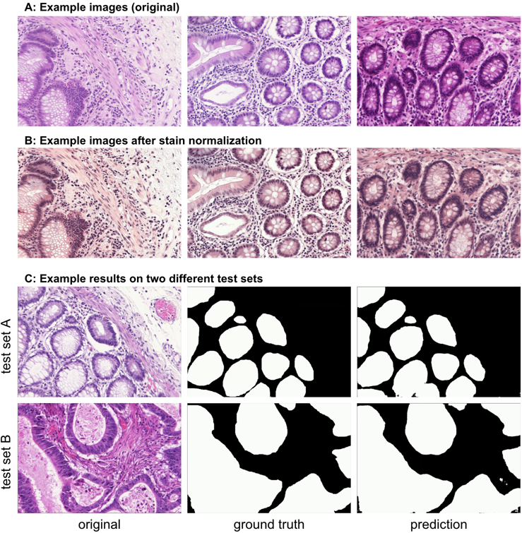
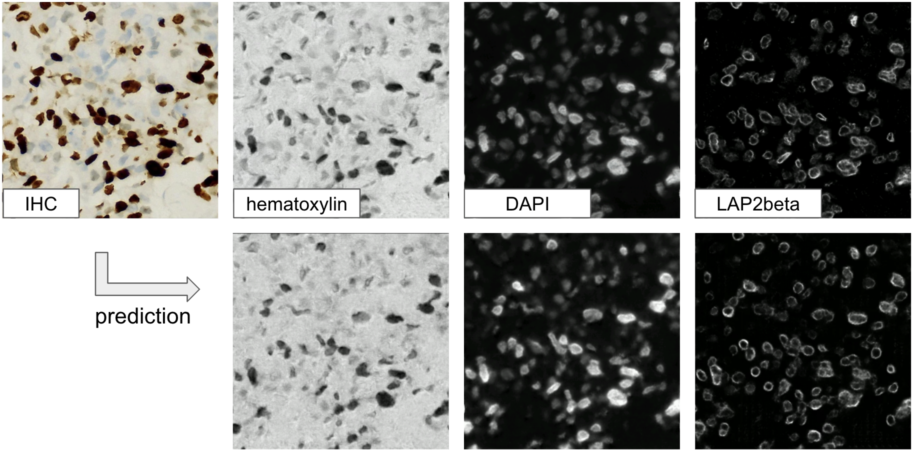

---
title: 'MMV_IM2IM: An Open Source Microscopy Machine Vision Toolbox for Image-to-Image Transformation'
keywords:
- deep learning
- microscopy image analysis
- open source
lang: en-US
date-meta: '2022-09-06'
author-meta:
- Justin Sonneck
- Jianxu Chen
header-includes: |-
  <!--
  Manubot generated metadata rendered from header-includes-template.html.
  Suggest improvements at https://github.com/manubot/manubot/blob/main/manubot/process/header-includes-template.html
  -->
  <meta name="dc.format" content="text/html" />
  <meta name="dc.title" content="MMV_IM2IM: An Open Source Microscopy Machine Vision Toolbox for Image-to-Image Transformation" />
  <meta name="citation_title" content="MMV_IM2IM: An Open Source Microscopy Machine Vision Toolbox for Image-to-Image Transformation" />
  <meta property="og:title" content="MMV_IM2IM: An Open Source Microscopy Machine Vision Toolbox for Image-to-Image Transformation" />
  <meta property="twitter:title" content="MMV_IM2IM: An Open Source Microscopy Machine Vision Toolbox for Image-to-Image Transformation" />
  <meta name="dc.date" content="2022-09-06" />
  <meta name="citation_publication_date" content="2022-09-06" />
  <meta name="dc.language" content="en-US" />
  <meta name="citation_language" content="en-US" />
  <meta name="dc.relation.ispartof" content="Manubot" />
  <meta name="dc.publisher" content="Manubot" />
  <meta name="citation_journal_title" content="Manubot" />
  <meta name="citation_technical_report_institution" content="Manubot" />
  <meta name="citation_author" content="Justin Sonneck" />
  <meta name="citation_author_institution" content="Leibniz-Institut für Analytische Wissenschaften - ISAS - e.V." />
  <meta name="citation_author_orcid" content="0000-0002-1640-3045" />
  <meta name="twitter:creator" content="@JustinSonneck" />
  <meta name="citation_author" content="Jianxu Chen" />
  <meta name="citation_author_institution" content="Leibniz-Institut für Analytische Wissenschaften - ISAS - e.V." />
  <meta name="citation_author_orcid" content="0000-0002-8500-1357" />
  <meta name="twitter:creator" content="@JianxuChen" />
  <link rel="canonical" href="https://MMV-Lab.github.io/im2im-paper/" />
  <meta property="og:url" content="https://MMV-Lab.github.io/im2im-paper/" />
  <meta property="twitter:url" content="https://MMV-Lab.github.io/im2im-paper/" />
  <meta name="citation_fulltext_html_url" content="https://MMV-Lab.github.io/im2im-paper/" />
  <meta name="citation_pdf_url" content="https://MMV-Lab.github.io/im2im-paper/manuscript.pdf" />
  <link rel="alternate" type="application/pdf" href="https://MMV-Lab.github.io/im2im-paper/manuscript.pdf" />
  <link rel="alternate" type="text/html" href="https://MMV-Lab.github.io/im2im-paper/v/d7d9dcb77b17029749065558010299b71050c043/" />
  <meta name="manubot_html_url_versioned" content="https://MMV-Lab.github.io/im2im-paper/v/d7d9dcb77b17029749065558010299b71050c043/" />
  <meta name="manubot_pdf_url_versioned" content="https://MMV-Lab.github.io/im2im-paper/v/d7d9dcb77b17029749065558010299b71050c043/manuscript.pdf" />
  <meta property="og:type" content="article" />
  <meta property="twitter:card" content="summary_large_image" />
  <link rel="icon" type="image/png" sizes="192x192" href="https://manubot.org/favicon-192x192.png" />
  <link rel="mask-icon" href="https://manubot.org/safari-pinned-tab.svg" color="#ad1457" />
  <meta name="theme-color" content="#ad1457" />
  <!-- end Manubot generated metadata -->
bibliography:
- content/manual-references.json
manubot-output-bibliography: output/references.json
manubot-output-citekeys: output/citations.tsv
manubot-requests-cache-path: ci/cache/requests-cache
manubot-clear-requests-cache: false
...

<small><em>
This manuscript
([permalink](https://MMV-Lab.github.io/im2im-paper/v/d7d9dcb77b17029749065558010299b71050c043/))
was automatically generated
from [MMV-Lab/im2im-paper@d7d9dcb](https://github.com/MMV-Lab/im2im-paper/tree/d7d9dcb77b17029749065558010299b71050c043)
on September 6, 2022.
</em></small>

## Authors

+ **Justin Sonneck** 
    {.inline_icon width=16 height=16}
    [0000-0002-1640-3045](https://orcid.org/0000-0002-1640-3045)
    · {.inline_icon width=16 height=16}
    [Justin-Sonneck](https://github.com/Justin-Sonneck)
    · {.inline_icon width=16 height=16}
    [JustinSonneck](https://twitter.com/JustinSonneck) 
  <small>
     Leibniz-Institut für Analytische Wissenschaften - ISAS - e.V.
     · Funded by The Federal Ministry of Education and Research (BMBF) under the funding reference 161L0272
  </small>

+ **Jianxu Chen** 
    {.inline_icon width=16 height=16}
    [0000-0002-8500-1357](https://orcid.org/0000-0002-8500-1357)
    · {.inline_icon width=16 height=16}
    [jxchen01](https://github.com/jxchen01)
    · {.inline_icon width=16 height=16}
    [JianxuChen](https://twitter.com/JianxuChen) 
  <small>
     Leibniz-Institut für Analytische Wissenschaften - ISAS - e.V.
     · Funded by The Federal Ministry of Education and Research (BMBF) under the funding reference 161L0272
  </small>

## Abstract

The deep learning research in computer vision has been growing extremely fast in the past decade, many of which have been translated into novel image analysis methods for biomedical problems. Broadly speaking, many deep learning based biomedical image analysis methods can be considered as a general image-to-image transformation framework. In this work, we introduce a new open source python package **MMV_Im2Im** for image-to-image transformation in bioimaging applications. The overall package is designed with a generic image-to-image transformation framework, which could be directly used for semantic segmentation, instance segmentation, image restoration, image generation, etc. The implementation takes advantage of the state-of-the-art machine learning engineering techniques for users to focus on the research without worrying about the engineering details. We demonstrate the effectiveness of **MMV_Im2Im** in more than ten different biomedical problems. For biomedical machine learning researchers, we hope this new package could serve as the starting point for their specific problems to stimulate new biomedical image analysis or machine learning methods. For experimental biomedical researchers, we hope this work can provide a holistic view of the image-to-image transformation concept with diverse examples, so that deep learning based image-to-image transformation could be further integrated into the assay development process and permit new biomedical studies that can hardly be done only with traditional experimental methods. Source code can be found at <https://github.com/MMV-Lab/mmv_im2im>. 

## Introduction

With the fast development of the machine learning (ML) and computer vision fields, computers are now able to transform images into new forms for better visualization [@doi:10.1109/CVPRW.2017.151], better animation [@doi:10.1109/CVPR.2017.632], better information extraction [@doi:10.1109/CVPR.2019.00963] with unprecedented and continuously growing accuracy and efficiency. 
Recently, such techniques have started to be adapted for bioimaging applications and revolutionized image-based biomedical research [@doi:10.1038/s41592-018-0111-2;@doi:10.1038/s42256-022-00471-x;@doi:10.1038/s41592-021-01080-z;@doi:10.1038/s41592-021-01249-6]. In principal, these techniques and applications can be formulated as a general image-to-image transformation problem, as illustrated in the central panel in Figure {@fig:overview}. 
In essence, deep neural networks are trained to perceive the information from the source image(s) and reconstruct the learned knowledge from source images(s) in the form of a new image(s) of the target type. 
Here, the source and target images can be real microscopy images, simulated microscopy images, segmentation masks, or their combinations, such as the examples in Figure {@fig:overview}. 
Considering the common essential spirit of all the underlying methods, a natural question to ask is whether it is possible to build a single generic codebase for deep learning based image-to-image transformation directly applicable to different biomedical studies.

In this paper, we introduce *MMV_Im2Im* an open-source microscopy machine vision (MMV) toolbox for image-to-image transformation that can be used in various biomedical applications. 
Currently, *MMV_Im2Im* supports 2D~5D microscopy images for supervised image-to-image translation (e.g., labelfree determination [@doi:10.1038/s41592-018-0111-2], imaging modality transformation [@doi:10.1038/s41592-021-01155-x;@doi:10.1038/s42256-022-00471-x]), supervised image restoration [@doi:10.1038/s41592-021-01080-z], supervised semantic segmentation [@doi:10.1007/978-3-319-24574-4_28], supervised instance segmentation [@embedseg], unsupervised semantic segmentation [@doi:10.1038/s42256-019-0096-2], unsupervised image to image translation and synthetization [@doi:10.1109/ICCV.2017.244]. 
The toolbox will continuously grow and more methods will be supported, especially methods based on self-supervised learning.

Why do we need such a generic codebase for all deep-learning based microscopy image-to-image transformation? *MMV_Im2Im* is not simply a collection of many existing methods, but with rather systematic design for generality, flexibility and simplicity, attempting to address many fundamental pain points for image-to-image transformation in biomedical applications, as highlighted below.

### Universal boilerplate with state-of-the-art ML engineering:

The toolbox employs pytorch-lightning [@doi:10.5281/zenodo.3828935] as the core in the backend, which offers numerous benefits, such as readability, flexibility and simplicity. First of all, have you ever encountered the situation where you want to understand the code from two different papers, even solving the same problem, e.g. semantic segmentation, but not quite easy to grasp quickly since the two repositories are implemented in very different ways? It is not rare that even different researchers from the same group may implement similar methods in very different manners. This is not only a barrier for other people to learn and re-use the open-source code, but also poses challenges for developers in maintenance, further development, and interoperability among different packages. 
We follow the pytorch-lightning framework and carefully design a universal boilerplate for image-to-image transformation for biomedical applications, where the implementation of all the methods share the same modularized code structure. This greatly lowers the learning curve for people to read and understand the code, and makes implementing new methods or extending existing methods simple and fast, at least from an engineering perspective.

Moreover, as ML scientists, have you ever overwhelmed by different training tricks for different methods or been curious about if certain state-of-the-art training methods can boost the performance of your models? With the pytorch-lightning backend, *MMV_Im2Im* allows you to enjoy different state-of-the-art ML engineering techniques without changing any line of code, e.g., stochastic weight averaging [@swatrain], single precision training, automatic batch size determination, different optimizers, different learning rate schedulers, easy deployment on different devices, distributed training on multi-GPU (even multi-node), logging with common loggers such as Tensorboard, etc.. In short, with the pytorch-lightning based universal boilerplate, one can really focus on research and develop novel methods for bioimaging applications, without worrying on the ML engineering works (which are usually lack in non-computer-science labs). 

### Modularization and human-readable configuration system:

The toolbox is designed for both computational biomedical imaging researchers (e.g., with expertise in biomedical imaging but only basic knowledge of Python or ML) and ML researchers (e.g. deep knowledge of ML methodology but with limited experience in microscopy). 
For this purpose, we design the toolbox in a systematically modularized way with various levels of configurability. 
One can use the toolbox with a single command as simple as `run_im2im --config train_semanticseg_3d --data.data_path /path/to/data` or make customization on details directly from a human-readable configuration file, such as choosing batch normalization or instance normalization in certain layers of the model, or adding extra data augmentation steps, etc.. For users without experience in Python programming, another MMV toolbox has been planned as the extension of *MMV_Im2Im* (see the Discussion section for details). 

In addition, the modularization and configuration system is designed to allow not only configuring with the elements offered by the package itself, but also any compatible elements from a third-party package or from a public repository on Github. 
For example, one can easily switch the 3D neural network in the original *Embedseg* method to any customized U-Net from FastAI by specifying the network as `fastai.vision.models.unet`. Such painless extendability releases the power of the toolbox, amplifies the benefit of the open-source ML community and upholds our philosophy of open science.

### Customization for biomedical imaging applications:

The original idea of a general toolbox actually stems from the OpenMMLab project (<https://openmmlab.com/>), which provides generic codebase for a wide range of computer vision research topics. 
For instance, *MMSegmentation* (<https://github.com/open-mmlab/mmsegmentation>) is an open source toolbox for semantic segmentation, supporting unified benchmarking and state-of-the-art models ready to use out-of-box. 
It has become one of most widely used codebase for research in semantic segmentation (1.6K forks and 4.3K stars on Github as of August 30, 2022). 
This inspires us to develop *MMV_Im2Im* to fascinate research in image-to-image transformation with special focus on biomedical applications. 

First of all, different from general computer vision datasets, such as ImageNet [@doi:10.1109/CVPR.2009.5206848], where the images are usually small 2D RGB images (e.g., 3 x 256 x 256 pixels), bioimaging applications usually involves large-scale high dimensional data (e.g., 4 x 128 x 2048 x 2048 voxels). To deal with this issue, we employ the PersistentDataset in MONAI [@doi:10.5281/zenodo.4323059] with partial loading and sampling support, as well as delayed image reading in aicsimageio [@doi:10.5281/zenodo.6585658]. 
As a result, in our stress test, training an 3D nuclei instance segmentation model with more than 125,000 3D images can be conducted efficiently, even with limited resource.

Second, because microscopy data is not restricted to 2D, we re-implement common frameworks, such as fully convolutional networks (FCN), conditional generative models, cycle-consistent generative models, etc., in a generic way to easily switch between different dimensionalities. 

Third, the toolbox pre-packs common functionalities specific to microscopy images. For example, we incorporate the special image normalization method introduced in [@doi:10.1038/s41592-018-0111-2], where only the middle chunk along Z dimension of 3D microscopy images will be used for calculating the mean and standard deviation of image intensity for standard normalization. Also, 3D light microscopy images are usually anisotropic, i.e., much lower resolution along Z than XY dimension. So, we adopt the anisotropic variation of UNet as proposed in [@doi:10.1101/491035]. 

Finally, to deploy the model in production, a model trained on small 3D patches sometimes need to be applied not only on much large images, but also with additional dimensionalities (e.g., multi-scene timelapse). Combining the efficient data handling of aicsimageio [@doi:10.5281/zenodo.6585658] and the sliding window inference with gaussian weighted blending, the toolbox can yield efficient inference without visible stitching artifacts in production. 

All in all, the *MMV_Im2Im* toolbox stands on the shoulders of many giants in the open-source software and ML engineering communities (pytorch-lightning, MONAI, aicsimageio, etc.) and is systematically designed for image-to-image transformation R&D for biomedical applications. The source code of *MMV_Im2Im* is available at <https://github.com/MMV-Lab/mmv_im2im>. This manuscript is generated with open-source package Manubot [@doi:10.1371/journal.pcbi.1007128]. The manuscript source code is available at <https://github.com/MMV-Lab/im2im-paper>.

{#fig:overview width="100%" height="53%"}

## Results

In this section, we demonstrated the versatility of the *MMV_Im2Im* toolbox with over ten different biomedical applications from different R&D use cases at different scales. All experiments and results in this section were conducted on public datasets and can be reproduced with the scripts (for pulling the public dataset online and data wrangling) and configuration files (for setting up training and inference details) released with the *MMV_Im2Im* package. It is worth emphasizing that the aim of these experiments were not to achieve the state-of-the-art performance on each individual task (may require further tuning of hyper-parameters, see Discussion section for more details). All experiments were conducted without much tuning, and essentially meant to demonstrate different features of the package and the general applicability. We intended to provide a holistic view of the image-to-image transformation concepts to biomedical researchers using a diverse set of applications. Hopefully, such concepts could help biomedical researchers to better integrate AI into traditional assay development strategies and inspire more computational and experimental co-design methods to realize new biomedical studies that were not very feasible before.

### Labelfree prediction of nuclear structure from 2D/3D brightfield images

The labelfree method refers a deep learning method that can predict fluorescent images directly from transmitted light brightfield images [@doi:10.1038/s41592-018-0111-2]. Comparing to brightfield images, fluorescent images can resolve subcellular structures in living cells at high resolution but with the cost of expensive and slow procedures and high phototoxicity. The labelfree method provides a new perspective in assay development to conduct integrated computational analysis of multiple organelles only with a single brightfield imaging acquisition. In our first demonstration, we applied *MMV_Im2Im* to build 2D/3D models that can predict fluorescent images of nuclear structures from brightfield images. For 3D models, we also compared (1) different image normalization methods, (2) different network backbones, and (3) different types of models. 

It is worth mentioning that systematic evaluation of the prediction is beyond the scope of this paper. We argue that a proper evaluation depends on specific downstream quantitative analysis goals. For example, if we want to quantify the size of the nucleoli, we have to compare the segmentation from real nucleoli signals and the segmentation from predicted nucleoli, and make sure the sizes measured from real signal are consistent with measurement from predictions. In contrast, if the goal is to roughly localize the nucleoli within the cell, pearson correlation might be more suitable. As a result, we only compared the results by visual inspection, for the sake of simplicity and focusing on the applicability of our *MMV_Im2Im* package, and left the systematic evaluations to users in specific problems in real studies.

*2D Model:* We started with a simple problem using 2D images from the HeLa "Kyoto" cells dataset [@doi:10.5281/zenodo.6139958]. For all images, we took the brightfield channel and the mCherry-H2B channel out of the multi-channel timelapse movies. 2D images were acquired at 20x with 0.8 N.A. and then downscaled by 4 (pixel size: 0.299 nm x 0.299 nm). Example predictions can be found in Figure {@fig:labelfree}-A. We compared a basic UNet model [@doi:10.1007/978-3-319-24574-4_28] and a 2D version of the fnet model in [@doi:10.1038/s41592-018-0111-2]. The fnet model achieved slightly more accurate predictions. 

*3D Model:* We tested with 3D images from the hiPS single cell image dataset [@doi:10.1101/2020.12.08.415562]. Specifically, we extracted the brightfield channel and the structure channel from the full field-of-view (FOV) multi-channel images, from the HIST1H2BJ, FBL, NPM1, LMNB1 cell lines, so as to predict from one brightfield image various nuclear structures, histones, nucleoli (dense fibrillar component via fibrillarin), nucleoli (granular component via nucleophosmin), and nuclear envelope, respectively. Images were acquired at 100x with 1.25 NA. (voxel size: 0.108 micron x 0.108 micron x 0.29 micron). 

We conducted three groups of comparisons (see results in Figure {@fig:labelfree})-B. First, we compared three different image normalization methods for 3D images (percentile normalization, standard normalization, center normalization [@doi:10.1038/s41592-018-0111-2]). Percentile normalization refers to cutting the intensity out of the range of [0.5, 99.5] percentile of the image intensity and then rescale the values to the range of [-1, 1], while the standard normalization is simply subtracting mean intensity and then divided by the standard deviation of all pixel intensities. Center normalization is similar to standard normalization, but the statistics are calculated only around center along the Z-axis. One could easily test different percentile or rescaling to [0, 1] instead of [-1, 1]. Qualitatively, we found center normalization slightly more accurate and more robust than the other two (ref. the first row in Figure {@fig:labelfree}-B).

Second, we compared different network backbone architectures, including original fnet model [@doi:10.1038/s41592-018-0111-2], enhanced UNet [@doi:10.1007/978-3-030-12029-0_40], attention UNet [@attentionUnet], two transformer-based models, SwinUNETR [@doi:10.1007/978-3-031-08999-2_22] and UNETR[@doi:10.1109/WACV51458.2022.00181] (all with center normalization). Inspecting the predictions on a holdout validation set suggested that fnet achieved the best performance, and the recent transformer-based models did not work well with in labelfree problems (ref. the second row and the "c + fnet" from the first row in Figure {@fig:labelfree}-B).

Finally, we showed the comparison between three different types of models, an FCN-type model (i.e., fnet), a pix2pix-type model, and a cycleGAN-type model. For fair comparison, we used fnet as the generator in the pix2pix-type model, while coupling with an adversarial discriminator. Then, the pix2pix-type model can be trained in two different ways: from scratch or initializing the generator with a pre-trained fnet. Examples of the comparison results were shown in the last two rows in Figure {@fig:labelfree}-B. Visually, it is evident that the additional adversarial components (i.e., the discriminator) could boost the performance of a typical FCN-type model to generate more realistic images than an FCN-type model alone.

From the experiments above, we found that center normalization + pix2pix with fnet as the generator achieved the best performance. So, we employed the same strategy on all other nuclear structures. At the end, we had four different labelfree models, each predicting one different nuclear structure from 3D brightfield images. As an example of evaluation, we calculated the pearson correlation and structural similarity on the validation set. The results were summarized in Table {@tbl:labelfree_table}. Again, these numbers were merely examples of evaluation, systematic evaluation based each specific biological problem would be necessary before deployment. Figure {@fig:labelfree}-C showed one example of all four different structures predicted from a single unseen brightfield image. This would permit an integrated analysis of cell nuclear components that could hardly be done with real experiments and real images.

| Dataset | Pearson Correlation | Structural Similarity | # of Test Data |
|----------|----------|----------|----------|
| FBL | 0.864 ± 0.021| 0.831 ± 0.034| 50 |
| HIST1H2BJ | 0.825 ± 0.034| 0.675 ± 0.073| 55 |
| LMNB1 | 0.853 ± 0.027| 0.669 ± 0.059| 50 |
| NPM1 | 0.912 ± 0.015| 0.795 ± 0.039| 55 |

Table: Evaluation of the final 3D label-free models for four different nuclear structures. {#tbl:labelfree_table}

{#fig:labelfree width="76%" height="90%"} 

### 2D semantic segmentation of tissues from H&E images

Segmentation is a common image processing task, and can be considered as a special type of image-to-image transformation, where the generated images are segmentation masks. Deep learning based methods have achieved huge success in 2D semantic segmentation in biomedical images. In this example, we demonstrated *MMV_Im2Im* on a pathology application to segment glands from hematoxylin and eosin (H&E) stained tissue images from the 2015 Gland Segmentation challenge [@doi:10.1109/TMI.2015.2433900;@doi:10.1016/j.media.2016.08.008]. Stain normalization is an important pre-processing step in order to develop models robust to stain variation and tissue variations. *MMV_Im2Im* included a classic stain normalization method [@doi:10.1109/ISBI.2009.5193250] as a pre-processing step. The effect of stain normalization can be observed in Figure {@fig:2d_gland}-A and B. We trained a simple attention UNet model [@attentionUnet]. Evaluated on the two different hold-out test sets, the model achieved F1-score, 0.883 and 0.888 on test set A and test set B, respectively. The performance was competitive comparing to the methods reported in challenge report [@doi:10.1016/j.media.2016.08.008], especially with much more consistent performance across the two different test sets. Example results can be found in Figure {@fig:2d_gland}-C.

{#fig:2d_gland width="75%"} 

### 3D semantic segmentation of organelles from electron microscopy images

Semantic segmentation in 3D biomedical image analysis application is not a simple generalization from 2D models by switching 2D operations with 3D operations, but with many practical challenges. Large GPU footprint is one of the biggest issues, which makes many training strategies common in 2D not feasible in 3D, e.g. limited mini-batch size. *MMV_Im2Im* is able to take advantage of state-of-the-art ML engineering methods to efficiently handle 3D problems. For example, by using effective half-precision training, one can greatly reduce GPU memory workload for each sample and therefore increase the batch size. When multiple GPUs are available, it is also possible to easily take advantage of the additional resources to scale up the training to multiple GPU cards, even multiple GPU nodes. Here, we trained a 3D model to segment seven different types of organelles (e.g., cell, mitochondrion, alpha granule, etc.) from SBF-SEM image volumes [@doi:10.1038/s41598-021-81590-0]. Example results can be found in Figure {@fig:3dseg}. The prediction still suffered from considerable errors, very likely due to the limited training data (only one image).

{#fig:3dseg width="75%"}

### Unsupervised semantic segmentation of intracelluar structures from 2D/3D confocal microscopy images

Large amount of high-quality training ground truth is not always available or may take endless effort to collect. CycleGAN based methods opened a new venue for segmentation without pixel-wise ground truth [@doi:10.1038/s42256-019-0096-2]. We demonstrated unsupervised learning based segmentation method for four examples: 2D tight-junction (via ZO1) segmentation from 2D FP-tagged ZO1 images (max-projected from 3D stacks) and segmentation of nuclei, mitochondria and golgi from 3D confocal microscopy images. Here, we took raw images from the hiPS single cell image dataset [@doi:10.1101/2020.12.08.415562] and their corresponding segmentation. We shuffled the raw images and their segmentation to perform unsupervised learning. In theory, the segmentation masks could be simulated as suggested in [@doi:10.1038/s42256-019-0096-2]. Here, for the sake of simplicity in the demonstration, we took the original segmentation (shuffled) as a set of simulated segmentation masks. The concept was illustrated in Figure {@fig:unsupervised}-A and example results of all 3D models were shown in Figure {@fig:unsupervised}-B. The F1-scores of on test set were summarized in Table {@tbl:unsuper}. On the 2D ZO1 example, we can observe that the segmentation generated by the unsupervised learning method actually was actually better than the original segmentation from the public dataset, which were obtained with a classic image segmentation workflow. For 3D examples, according to [@doi:10.1038/s42256-019-0096-2], the quality of unsupervised nuclei segmentation could be further improved with additional simulation strategies. In general, we can observe that unsupervised learning could offer an effective way to generate preliminary segmentation, which can be further curated to train additional models in supervised ways, like the iterative deep learning workflow in [@doi:10.1101/491035]. 

| Dimensionality | Dataset | F1 Score | # of Test Data |
|----------|----------|----------|----------|
| 2D | tight-junction | 0.888 ± 0.022 | 29 |
| 3D | nucleus | 0.811 ± 0.150| 15 |
| 3D | golgi | 0.705 ± 0.022| 6 |
| 3D | mitochondria | 0.783 ± 0.005| 2 |

Table: F1 scores of the unsupervised semantic segmentation predictions. {#tbl:unsuper}

{#fig:unsupervised width="90%"}

### Instance segmentation in microscopy images

Another type of segmentation, other than semantic segmentation, is the instance segmentation problem. The goal is to not only differentiate different types of objects, but also different instances of the same type of objects. Currently, *MMV_Im2Im* supports *EmbedSeg*-type models (re-implemented from the original paper following the generic boilerplate in *MMV_Im2Im*). The major benefit of *EmbedSeg*-type models is that this method is agnostic to the morphology and dimensionality of the objects, comparing to other FCN-type models like StarDist [@doi:10.1007/978-3-030-00934-2_30;@doi:10.1109/WACV45572.2020.9093435] (difficult in handling different shapes, e.g. elongated concave objects) and CellPose [@doi:10.1038/s41592-020-01018-x] or SplineDist [@doi:10.1109/ISBI48211.2021.9433928] (not straightforward to generalize to higher dimensions). Another category of mainstream instance segmentation methods is detection based models, such as Mask-RCNN [@doi:10.1109/TPAMI.2018.2844175], which fits more to the detection framework, instead of image-to-image transformation (see Discussion section for details). As a demonstration, we applied *EmbedSeg*-like models on a 2D problem of segmenting *C. elegans* from widefield images [@doi:10.1021/cb900084v] and a 3D problem of nuclear segmentation from fluorescent images and brightfield images from the hiPS single cell image dataset [@doi:10.1101/2020.12.08.415562]. 

For the 2D problem, we adopted the same network backbone as in the original *EmbedSeg* paper. 
Example results on a small holdout set are shown in Figure {@fig:instance}-A (IoU = 0.86). 
For the 3D problem, the original method is not directly applicable for two reasons. 
First, we cannot use the original network architecture, ERF-Net-3D, because the images have very anisotropic dimensions and there are not enough Z-slices to run through all down sampler blocks in 3D. Second, we cannot use the original training function, because some parts of the images do not have ground truth and the original training method requires fully annotated images. (Note: the segmentation results from the public dataset [@doi:10.1101/2020.12.08.415562] contain nuclear instance segmentation of all cells. But, the cells touch the image borders are ignored from downstream analysis and therefore not curated. In other words, the segmentation from this public dataset can be used as high-quality nuclear instance segmentation ground truth after excluding the areas covered by cells touching the image borders [@doi:10.1101/2020.12.08.415562].) 
In this example, we showcased (1) how to easily swap the network backbone with a network from public repositories on Github, and (2) how to easily train the model with pixel-wise cost map or exclusion masks (i.e., certain pixels can be excluded from training). Another extension comparing to the original implementation was that the *MMV_Im2Im* package made sliding windowing inference straightforward, and therefore permitted easy handling of images of any size during inference in practice. 
For network, we directly imported a model from a public Github repository <https://github.com/AllenCell/aics-ml-segmentation> for segmentation in fluorescent images and a model from another public Github repository <https://github.com/AllenCellModeling/pytorch_fnet> for segmentation in brightfield images. 
For exclusion masks, all the areas covered by cells touching the image border were assigned to 0, otherwise 1, as a cost map. 

Example results were presented in {@fig:instance}-B. The green box highlighted a mitotic cell (the DNA signals forming "spaghetti" shapes). Besides roughly separating the DNA signals from background, the model was also able to correctly identify the instance identity, which would be theoretically infeasible for other FCN-type instance segmentation models. 
Nuclear instance segmentation from brightfield images was much more challenging than from fluorescent images. Arguably, this could be thought of as one single model doing two transformations: predicting the DNA signals from brightfield and running instance segmentation on predicted DNA signals. From Figure {@fig:instance}-B, it was shown that the segmentation from brightfield images was comparable to the segmentation from fluorescent images, but with two caveats. First, the performance on mitotic cells was worse than the model using fluorescent images. We hypothesized this could be due to the limited information in brightfield images for mitotic cells, compounded with limited number of mitotic cells in the whole training set (less than 10%). Second, the performance along Z dimension was also worse than the fluorescent model, as explained by the side view in Figure {@fig:instance}-B. This could be explained by the different properties of brightfield imaging and fluorescent imaging, but would need further comprehensive studies to investigate. 

{#fig:instance width="90%"}

### Generating synthetic microscopy images from binary Masks 

Sometimes, being able to generate a large amount of synthetic microscopy images would be an important step for developing image analysis methods. For example, we can use the synthetic images to train other deep learning models. As long as the images can be synthesized good enough, we could have unlimited amount of training data "for free" for certain applications. In addition, the synthetic images could also be used to evaluate other models when validation data are not easy to obtain. We wanted to demonstrate that *MMV_Im2Im* could also be used to generate 2D/3D synthetic microscopy images with high realism, either in a supervised or unsupervised manner. To do this, we collect a subset data from the hiPS single cell image dataset [@doi:10.1101/2020.12.08.415562]. For a 3D demonstration, we took the nuclear segmentation from the dataset as input, and the real H2B images as the training target. In the 2D case, we extracted the middle Z-slice from NPM1 images as the training target, while using the NPM1 segmentation results as the input binary mask. With the paired "mask + microscopy image" data, we could train the model in a supervised fashion, or randomly shuffle the data to simulate the situation without paired data and train the model in an unsupervised fashion. Example results can be found in Figure {@fig:synthetic}.

{#fig:synthetic width="70%"}

### Image denoising for microscopy images

*MMV_Im2Im* can also be used to significantly reduce image noise or restore the data from various sources of imaging artifacts, so as to increase the feasibility and efficiency in downstream analysis. In the current version of *MMV_Im2Im*, the restoration model can only be trained in a fully supervised manner. Therefore, aligned low quality and high quality images are required for supervision, even though such pair data can be partially simulated [@doi:10.1038/s41592-021-01080-z]. Other methods, such as unsupervised learning based solutions [@doi:10.1109/ISBI45749.2020.9098612,@HDN], will be made available within *MMV_Im2Im* in future versions. 

In this example, we presented an image denoising demonstration with sample data from [@doi:10.1038/s41592-018-0216-7]. The goal was to increase the quality of low signal-to-noise ratio (SNR) images of nucleus-stained flatworm (Schmidtea mediterranea) and lightsheet images of Tribolium castaneum (red flour beetle) embryos. The models were trained with paired data acquired with low and high laser intensity on fixed samples, and then applied on live imaging data. For the nucleus-stained flatworm data (a test set of 20 images are available), the model achieved pearson correlation of 0.923 ± 0.029 and structural similarity of 0.627 ± 0.175. Based on the results in Figure {@fig:denoising}, it can be observed that the low SNR images can be greatly improved. Systematic quantitative evaluations would be necessary to confirm the biological validity, but beyond the scope of this paper.

![(A) Denoising results of 3D images of nucleus-stained flatworm at two different z-slices. Left: raw images (low SNR), middle: reference images (high SNR), right: predictions. (B) Denoising results of 3D lightsheet images of Tribolium castaneum (fixed samples) at two different z-slices. Left: raw images (low SNR), middle: Reference images (high SNR), right: predictions. (C) Denoising results of 3D lightsheet images of Tribolium castaneum (live samples) without high SNR reference. Top: the raw image, bottom: the prediction.](images/denoising.png){#fig:denoising width="80%"}

### Imaging modality transformation from 3D confocal microscopy images to stimulated emission depletion (STED) microscopy images

Another important application of image-to-image transformation is imaging modality transformation [@doi:10.1038/s41592-021-01155-x], usually from one "cheaper" modality with lower resolution (e.g., with larger field-of-view, easier to acquire and scale up) to another modality with higher resolution but expensive to obtain. Such models will permit a completely new way in assay development strategy to take advantage of all the benefits of the cheaper modality with lower resolution and still able to enhance the resolution computationally post hoc. To demonstrate the application of *MMV_Im2Im* in this scenario, we took an example dataset with paired 3D confocal and Stimulated Emission Depletion (STED) images of two different cellular structures [@doi:10.1038/s41592-021-01155-x]. Sample results were summarized in Figure {@fig:modality}. For microtubule, the model achieved pearson correlation of 0.779 ± 0.019, while for nuclear pore complex, the pearson correlation was 0.784 ± 0.028. Also, visual inspection can confirm the effectiveness of the models. Again, it would be necessary to conduct further quantitative evaluation to ensure the validity in users' specific problems.

{#fig:modality width="65%" height="70%"}

### Staining transformation in multiplex experiments

Beyond common light microscope for bioimaging, deep learning based image-to-image transformation has become one of the important weapons in multiplex studies [@doi:10.1038/s42256-022-00471-x]. The capability of transforming tissue images among different stainings, such as immunohistochemistry (IHC) and multiplex immunofluorescence (mpIF), would create new possibility for efficient co-registration, co-localization and quantitative analysis. In this section, we demonstrated the applicability of *MMV_Im2Im* in transforming tissue images from one staining to others with sample data from [@doi:10.1038/s42256-022-00471-x]. In this example, we trained three different models to transform IHC images to images of standard hematoxylin stain, mpIF nuclear (DAPI) and mpIF LAP2beta (a nuclear envelope stain). Example results can be observed in Figure {@fig:multiplex} to verify the results qualitatively.

{#fig:multiplex}

## Methods

### Overview of the code base

Overall, the package inherited the boilerplate concept from pytorch-lightning (<https://www.pytorchlightning.ai/>), and was made fully configurable via yaml files supported by pyrallis (<https://github.com/eladrich/pyrallis>), as well as largely employed state-of-the-art deep learning components from MONAI (<https://monai.io/>). The three key parts in the package: mmv_im2im.models, mmv_im2im.data_modules, and Trainers, will be further described below.

### Main frameworks for mmv_im2im.models

*mmv_im2im.models* is the core module defining the deep learning framework for your problem, where we can instantiate the neural network architecture and define what to do before training starts, what to do in each training and validation step, what to do at the end of each epoch, etc.. All implemented following the same lightning module from pytorch-lightning, which makes the code very easy to read, to understand, and even to extend. 

In general, there are mainly four major deep learning frameworks that could be applied to microscopy image-to-image transformation: supervised learning with a fully convolutional networks (FCN) type models, supervised learning with pix2pix type models, unsupervised learning to learn mapping between visual domains, and Self2Self-type self-supervised learning [@doi:10.48550/arXiv.2206.13419]. The major difference between FCN based supervised learning and pix2pix based supervised learning is that the pix2pix framework extends an FCN model with an adversarial head as a discriminator to further improves the realism of the prediction. The major difference between the unsupervised framework and the self-supervised framework is that the unsupervised methods still requires examples of the target images, even though the source images and target images do not need to be from the same sample or pixel-wise aligned. But, the self-supervised framework would only need the original images, which could be really helpful when it is impossible to acquire the target images (e.g., there is no truely noise-free or artifact-free image). 

Currently, both the FCN-type and pix2pix-type supervised frameworks are well supported in the *MMV_Im2Im* package. Since our package is designed in a very generic way, it is possible to continuously expand the functionalities when available (ideally with community contributions). For example, diffusion models [@doi:10.48550/arXiv.2208.14125] can be thought of a modern extension of the pix2pix-type framework and therefore are within our horizon to include into *MMV_Im2Im*. For the unsupervised framework, only CycleGAN-type methods are supported. We are planning to extend the unsupervised framework with Imaginaire (<https://github.com/NVlabs/imaginaire>), which will greatly extend the applicability of *MMV_Im2Im* (e.g., learning the transformation from one single image to another single image or one set of images to another set of images). Meanwhile, supporting the self-supervised framework will be our next major milestone. 

### Customized mmv_im2im.data_modules for bioimaging applications

The *data_modules* implements a general module for data handling, from how to load the data to how to set up the dataloader for training and validation. Different people may prefer to organize their training data in different ways, such as using csv to organize input and the corresponding ground truth, or making different folders (e.g. "image" and "ground_truth") with input and the corresponding ground truth sharing the same file name, etc.. Or some people may prefer to do a random train/validation split, while others like to pre-split train and validation into different folders, etc.. Currently, the *data_module* in *MMV_Im2Im* supports four different ways of data loading, where we try to cover as many common scenario as possible, so that everyone will feel comfortable using it. 

A big challenge in the dataloader in bioimaging applications is that there could be not only a large amount of files, but also files of very large sizes. To deal with each individual large image, we used the delayed loading from aicsimageio for efficient image reading. Besides, we adopted the PersistentDataloader from MONAI to further optimize the efficiency. In specific, after loading a large image and running through all the deterministic operations, like intensity normalization or spatial padding, the PersistentDataLoader will pickle and save the data in a temporary folder, to avoid repeating the heavy computation on large files in each training iteration. To handle the potentially large number of files, we implemented the data_module with capability of loading only a certain portion of the data into the memory in each epoch and reloading with a different portion every certain number of epochs. By doing this, we were able to efficiently train an instance segmentation model with more than 125K images, where each raw image is about 15MB.

### State-of-the-art training with the pytorch-lightning Trainer

We fully adopted the Trainer from pytorch-lightning, which has been widely used by the machine learning community, and wildly tested on both R&D problems and industrial-scale applications. In a nutshell, simply by specifying the training parameters in the yaml file, users can setup multi-GPU training, half-precision training, automatic learning rate finder, automatic batch size finder, early stopping, stochastic weight averaging, etc.. This allows users to focus on the research problems without worrying about the ML engineering. 

## Discussions

In this work, we presented a new open source python package *MMV_Im2Im* package for image-to-image transformations in bioimaging applications. We demonstrated the applicability on more than ten different problems or datasets to give biomedical researchers a holistic view of the general image-to-image transformation concepts with diverse examples. This package was not a simple collection of existing methods. Instead, we distilled the knowledge from existing methods and created this generic version with state-of-the-art ML engineering techniques, which made the package easy to understand, easy to use, and easy to extend for future. We hope this package can serve the starting point for other researchers doing AI-based image-to-image transformation research, and eventually build a large shared community in the field of image-to-image transformation for bioimaging. 

One of main directions for extending *MMV_Im2Im* is to pre-pack common bioimaging datasets as a *Dataset* module, so that users can easily test and benchmarking their method development. Besides the continuous improvement on the functionalities of the package, we also plan to develop two auxillary packages *MMV_Im2Im_Auto* and *MMV_Im2Im_Active*. In specific, when you have a reasonable amount of training data, MMV_Im2Im_Auto will take advantage of fact that *MMV_Im2Im* is fully configurable with yaml files, and automatically generate a set of potentially good configurations, then find the optimal solution for you. On the other hand, when you only have very limited training data, or even with only pseudo ground truth, *MMV_Im2Im_Active* will help to build preliminary models from the limited training data, and gradually refine the model with human-in-the-loop by active learning. All the packages will also be wrapped into Napari plugins [@doi:10.5281/zenodo.3555620] to allow no-code operation and therefore be more friendly to users without experience in programming. 

Finally, beyond *MMV_Im2Im*, we hope to build develop similar package for other problems (without re-inventing wheels). For example, as we mentioned in the instance segmentation application, Mask-RCNN type models are also very powerful instance segmentation methods and, in theory, can also be generalized beyond 2D images. However, Mask-RCNN would fit more to a detection framework, instead of image-to-image transformation. It will be supported in our *MMV_NDet* (NDet = N-dimensional detection) package. 

## Acknowledgments

We would like to thank the MONAI team for their support in our process of development, and the aicsimageio team for advices on how to integrate aicsimageio into the package. This work is supported by the Federal Ministry of Education and Research (Bundesministerium für Bildung und Forschung, BMBF) under the funding reference 161L0272.

## References {.page_break_before}

<!-- Explicitly insert bibliography here -->

